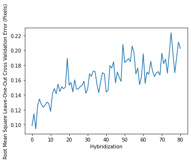

# Example

Note: this page was generated from a jupyter notebook and sample data both of which are freely available in the [seqfish_fm_match github repository](https://github.com/CaiGroup/seqfish_fm_match).

```python
import pandas as pd
import numpy as np
from seqfish_fm_match_ import FMMatcher
import matplotlib.pyplot as plt
```

### Read in example data


```python
ref_init = pd.read_csv("../example_data/initial_reference.csv")
ref_final = pd.read_csv("../example_data/final_reference.csv")
ro = pd.read_csv("../example_data/bright_ro_dots.csv")
```

Example data is from channel 561 of position 4 in replicate 2 of the original seqFISH+ NIH3T3 cell experiment. It was chosen for its small size. x and y distance units are in pixels. Intensity units are arbitrary.

### Look at the data


```python
ref_init.head()
```


<div>
<style scoped>
    .dataframe tbody tr th:only-of-type {
        vertical-align: middle;
    }

    .dataframe tbody tr th {
        vertical-align: top;
    }

    .dataframe thead th {
        text-align: right;
    }
</style>
<table border="1" class="dataframe">
  <thead>
    <tr style="text-align: right;">
      <th></th>
      <th>x</th>
      <th>y</th>
      <th>z</th>
      <th>int</th>
    </tr>
  </thead>
  <tbody>
    <tr>
      <th>0</th>
      <td>31.999543</td>
      <td>1080.999984</td>
      <td>0</td>
      <td>17773.627270</td>
    </tr>
    <tr>
      <th>1</th>
      <td>114.754283</td>
      <td>544.884195</td>
      <td>0</td>
      <td>6868.670956</td>
    </tr>
    <tr>
      <th>2</th>
      <td>86.710022</td>
      <td>1613.105294</td>
      <td>0</td>
      <td>3367.605233</td>
    </tr>
    <tr>
      <th>3</th>
      <td>421.228328</td>
      <td>864.232003</td>
      <td>0</td>
      <td>3608.949352</td>
    </tr>
    <tr>
      <th>4</th>
      <td>680.397582</td>
      <td>491.218607</td>
      <td>0</td>
      <td>3503.164018</td>
    </tr>
  </tbody>
</table>
</div>


```python
ref_final.head()
```


<div>
<style scoped>
    .dataframe tbody tr th:only-of-type {
        vertical-align: middle;
    }

    .dataframe tbody tr th {
        vertical-align: top;
    }

    .dataframe thead th {
        text-align: right;
    }
</style>
<table border="1" class="dataframe">
  <thead>
    <tr style="text-align: right;">
      <th></th>
      <th>x</th>
      <th>y</th>
      <th>z</th>
      <th>int</th>
    </tr>
  </thead>
  <tbody>
    <tr>
      <th>0</th>
      <td>31.999262</td>
      <td>1080.999826</td>
      <td>0</td>
      <td>17956.057860</td>
    </tr>
    <tr>
      <th>1</th>
      <td>115.548279</td>
      <td>540.132421</td>
      <td>0</td>
      <td>4546.240240</td>
    </tr>
    <tr>
      <th>2</th>
      <td>730.826144</td>
      <td>424.953615</td>
      <td>0</td>
      <td>3666.393698</td>
    </tr>
    <tr>
      <th>3</th>
      <td>792.032219</td>
      <td>473.490937</td>
      <td>0</td>
      <td>4207.299912</td>
    </tr>
    <tr>
      <th>4</th>
      <td>823.372502</td>
      <td>1016.670800</td>
      <td>0</td>
      <td>9650.076824</td>
    </tr>
  </tbody>
</table>
</div>


```python
ro.head()
```


<div>
<style scoped>
    .dataframe tbody tr th:only-of-type {
        vertical-align: middle;
    }

    .dataframe tbody tr th {
        vertical-align: top;
    }

    .dataframe thead th {
        text-align: right;
    }
</style>
<table border="1" class="dataframe">
  <thead>
    <tr style="text-align: right;">
      <th></th>
      <th>hyb</th>
      <th>x</th>
      <th>y</th>
      <th>z</th>
      <th>int</th>
    </tr>
  </thead>
  <tbody>
    <tr>
      <th>0</th>
      <td>0</td>
      <td>31.999691</td>
      <td>1081.000000</td>
      <td>0</td>
      <td>17634.928440</td>
    </tr>
    <tr>
      <th>1</th>
      <td>0</td>
      <td>115.753690</td>
      <td>544.112930</td>
      <td>0</td>
      <td>8089.031985</td>
    </tr>
    <tr>
      <th>2</th>
      <td>0</td>
      <td>87.782786</td>
      <td>1612.176181</td>
      <td>0</td>
      <td>3768.478697</td>
    </tr>
    <tr>
      <th>3</th>
      <td>0</td>
      <td>272.071022</td>
      <td>1516.792724</td>
      <td>0</td>
      <td>3625.500395</td>
    </tr>
    <tr>
      <th>4</th>
      <td>0</td>
      <td>422.286671</td>
      <td>863.441670</td>
      <td>0</td>
      <td>3874.274898</td>
    </tr>
  </tbody>
</table>
</div>


### Index the readout dataframe by the hyridization in which the dots were found


```python
ro.set_index("hyb", inplace=True)
ro.head()
```


<div>
<style scoped>
    .dataframe tbody tr th:only-of-type {
        vertical-align: middle;
    }

    .dataframe tbody tr th {
        vertical-align: top;
    }

    .dataframe thead th {
        text-align: right;
    }
</style>
<table border="1" class="dataframe">
  <thead>
    <tr style="text-align: right;">
      <th></th>
      <th>x</th>
      <th>y</th>
      <th>z</th>
      <th>int</th>
    </tr>
    <tr>
      <th>hyb</th>
      <th></th>
      <th></th>
      <th></th>
      <th></th>
    </tr>
  </thead>
  <tbody>
    <tr>
      <th>0</th>
      <td>31.999691</td>
      <td>1081.000000</td>
      <td>0</td>
      <td>17634.928440</td>
    </tr>
    <tr>
      <th>0</th>
      <td>115.753690</td>
      <td>544.112930</td>
      <td>0</td>
      <td>8089.031985</td>
    </tr>
    <tr>
      <th>0</th>
      <td>87.782786</td>
      <td>1612.176181</td>
      <td>0</td>
      <td>3768.478697</td>
    </tr>
    <tr>
      <th>0</th>
      <td>272.071022</td>
      <td>1516.792724</td>
      <td>0</td>
      <td>3625.500395</td>
    </tr>
    <tr>
      <th>0</th>
      <td>422.286671</td>
      <td>863.441670</td>
      <td>0</td>
      <td>3874.274898</td>
    </tr>
  </tbody>
</table>
</div>


### Create the FMMatcher Object


```python
dm = FMMatcher(ro, ref_init, ref_final)
```
 

### Auto find parameters. 
This does a grid search for parameters that work well in matching the initial and final reference fiducial marker patterns, so it might take a few minutes.


```python
dm.auto_set_params()
```


### You can save and load the parameters


```python
dm.save_params("saved_parameters.csv")

ref_init = pd.read_csv("../example_data/initial_reference.csv")
ref_final = pd.read_csv("../example_data/final_reference.csv")
dm2 = FMMatcher(ro, ref_init, ref_final)
dm2.load_saved_parameters("saved_parameters.csv")
```
 

### Alternatively, set the search parameters manually. Only one set of reference fiducial markers is necessary if you do this.


```python
ref_init = pd.read_csv("../example_data/initial_reference.csv")
dm3 = FMMatcher(ro, ref_init)
```

    Finding Reference Edges
    

These parameters must be set manually if you do not run the auto_set_params method


```python
dm3.set_xy_search_error(0.39) # The lateral position vectors between pairs of fiducial markers in the reference
                               # and readout images are allowed to differy by 0.39 distance units
    
dm3.set_z_search_error(0) # the z position vectors between pairs of fiducial markers in the reference
                               # and readout images are allowed to differ by 0 distance units (the example data is 2D)
    
dm3.set_min_bright_prop(0.18) # the intensity of readout dots matched to reference dots must be at least 0.18 times 
                               # the reference intensity
    
dm3.set_max_bright_prop(3.7) # the intensity of readout dots matched to reference dots must be no more than 3.7
                              # times the reference intensity
```

These parameters have a default value, and to not require, but allow user tuning. Default values are set here.


```python
dm3.set_min_edge_match(5) # readout dots must be matched in at least 5 fiducial marker pairs to be considered well match

dm3.set_n_longest_edges(30*len(ref_init.x)) # index this many of the farthest apart pairs of fiducial markers in the 
                                             # reference imageto search for initial matches in each hybs
    
dm3.set_n_unmatch_give_up(100) # If after finding an inital fatching pair, the first 100 other reference fiducial markers
                                #searched for are not found, consider the initial match a false match
    
dm3.set_min_dot_matches(10) # fiducial marker pattern matches finding fewer than 10 dots in the readout are failures.

dm3.set_outlier_sd_thresh(3.0) # remove fiducial that drift a distance of z-score 3 or greater than the others

dm3.set_min_fm_hyb_matches(int((max(ro.index)-min(ro.index))/2)) # fiducial markers should be found at in at least
                                                                            # half of the hybridizations
```

    Finding Reference Edges
    

These parameters are optional and ommited by default, but can help speed up the computation if provided


```python
dm3.set_max_lat_offset(500) # only match dots in readout images that have drifted less than 500 lateral distance units 
                             # from their location in the reference image
dm3.set_max_z_offset(10) # only match dots in readout stacks that have drifted less than 10 z distance units 
                          # from their location in the reference stack.
```

## Run the Alignment


```python
dm.align()
```


### View the results


```python
dm.offsets
```


<div>
<style scoped>
    .dataframe tbody tr th:only-of-type {
        vertical-align: middle;
    }

    .dataframe tbody tr th {
        vertical-align: top;
    }

    .dataframe thead th {
        text-align: right;
    }
</style>
<table border="1" class="dataframe">
  <thead>
    <tr style="text-align: right;">
      <th></th>
      <th>hyb</th>
      <th>x</th>
      <th>y</th>
      <th>z</th>
      <th>x_SE</th>
      <th>y_SE</th>
      <th>z_SE</th>
      <th>n_matches</th>
    </tr>
  </thead>
  <tbody>
    <tr>
      <th>0</th>
      <td>0</td>
      <td>0.953194</td>
      <td>-0.781336</td>
      <td>0.0</td>
      <td>0.007805</td>
      <td>0.005930</td>
      <td>0.0</td>
      <td>88</td>
    </tr>
    <tr>
      <th>1</th>
      <td>1</td>
      <td>1.417761</td>
      <td>-0.500650</td>
      <td>0.0</td>
      <td>0.008526</td>
      <td>0.008233</td>
      <td>0.0</td>
      <td>77</td>
    </tr>
    <tr>
      <th>2</th>
      <td>2</td>
      <td>1.706141</td>
      <td>-0.292566</td>
      <td>0.0</td>
      <td>0.005957</td>
      <td>0.005933</td>
      <td>0.0</td>
      <td>73</td>
    </tr>
    <tr>
      <th>3</th>
      <td>3</td>
      <td>1.011257</td>
      <td>-0.176718</td>
      <td>0.0</td>
      <td>0.007645</td>
      <td>0.008230</td>
      <td>0.0</td>
      <td>81</td>
    </tr>
    <tr>
      <th>4</th>
      <td>4</td>
      <td>0.830480</td>
      <td>-0.149615</td>
      <td>0.0</td>
      <td>0.007187</td>
      <td>0.007166</td>
      <td>0.0</td>
      <td>75</td>
    </tr>
    <tr>
      <th>...</th>
      <td>...</td>
      <td>...</td>
      <td>...</td>
      <td>...</td>
      <td>...</td>
      <td>...</td>
      <td>...</td>
      <td>...</td>
    </tr>
    <tr>
      <th>76</th>
      <td>76</td>
      <td>2.373315</td>
      <td>-2.655393</td>
      <td>0.0</td>
      <td>0.014264</td>
      <td>0.018030</td>
      <td>0.0</td>
      <td>77</td>
    </tr>
    <tr>
      <th>77</th>
      <td>77</td>
      <td>2.213059</td>
      <td>-2.804471</td>
      <td>0.0</td>
      <td>0.010665</td>
      <td>0.014049</td>
      <td>0.0</td>
      <td>66</td>
    </tr>
    <tr>
      <th>78</th>
      <td>78</td>
      <td>1.878191</td>
      <td>-2.918742</td>
      <td>0.0</td>
      <td>0.010371</td>
      <td>0.018617</td>
      <td>0.0</td>
      <td>71</td>
    </tr>
    <tr>
      <th>79</th>
      <td>79</td>
      <td>1.208916</td>
      <td>-2.967791</td>
      <td>0.0</td>
      <td>0.014505</td>
      <td>0.019095</td>
      <td>0.0</td>
      <td>71</td>
    </tr>
    <tr>
      <th>80</th>
      <td>80</td>
      <td>1.080502</td>
      <td>-2.926247</td>
      <td>0.0</td>
      <td>0.011422</td>
      <td>0.019532</td>
      <td>0.0</td>
      <td>72</td>
    </tr>
  </tbody>
</table>
<p>81 rows × 8 columns</p>
</div>


### View error estimates


```python
dm.loocv_alignment_errors
```


<div>
<style scoped>
    .dataframe tbody tr th:only-of-type {
        vertical-align: middle;
    }

    .dataframe tbody tr th {
        vertical-align: top;
    }

    .dataframe thead th {
        text-align: right;
    }
</style>
<table border="1" class="dataframe">
  <thead>
    <tr style="text-align: right;">
      <th></th>
      <th>ref_x</th>
      <th>ref_y</th>
      <th>ref_z</th>
      <th>ref_int</th>
      <th>hyb</th>
      <th>loocv_align_x</th>
      <th>loocv_align_y</th>
      <th>loocv_align_z</th>
      <th>comp_int</th>
      <th>x_diff</th>
      <th>y_diff</th>
      <th>z_diff</th>
    </tr>
  </thead>
  <tbody>
    <tr>
      <th>0</th>
      <td>114.754283</td>
      <td>544.884195</td>
      <td>0.0</td>
      <td>6868.670956</td>
      <td>0</td>
      <td>114.805972</td>
      <td>544.889225</td>
      <td>0.0</td>
      <td>8089.031985</td>
      <td>0.051689</td>
      <td>0.005030</td>
      <td>0.0</td>
    </tr>
    <tr>
      <th>1</th>
      <td>114.754283</td>
      <td>544.884195</td>
      <td>0.0</td>
      <td>6868.670956</td>
      <td>1</td>
      <td>114.741675</td>
      <td>544.813096</td>
      <td>0.0</td>
      <td>5899.712727</td>
      <td>-0.012608</td>
      <td>-0.071099</td>
      <td>0.0</td>
    </tr>
    <tr>
      <th>2</th>
      <td>114.754283</td>
      <td>544.884195</td>
      <td>0.0</td>
      <td>6868.670956</td>
      <td>2</td>
      <td>114.767609</td>
      <td>544.805502</td>
      <td>0.0</td>
      <td>5570.644691</td>
      <td>0.013326</td>
      <td>-0.078693</td>
      <td>0.0</td>
    </tr>
    <tr>
      <th>3</th>
      <td>114.754283</td>
      <td>544.884195</td>
      <td>0.0</td>
      <td>6868.670956</td>
      <td>3</td>
      <td>114.743385</td>
      <td>544.885821</td>
      <td>0.0</td>
      <td>6709.645106</td>
      <td>-0.010898</td>
      <td>0.001626</td>
      <td>0.0</td>
    </tr>
    <tr>
      <th>4</th>
      <td>114.754283</td>
      <td>544.884195</td>
      <td>0.0</td>
      <td>6868.670956</td>
      <td>4</td>
      <td>114.764577</td>
      <td>544.866750</td>
      <td>0.0</td>
      <td>7184.663680</td>
      <td>0.010294</td>
      <td>-0.017444</td>
      <td>0.0</td>
    </tr>
    <tr>
      <th>...</th>
      <td>...</td>
      <td>...</td>
      <td>...</td>
      <td>...</td>
      <td>...</td>
      <td>...</td>
      <td>...</td>
      <td>...</td>
      <td>...</td>
      <td>...</td>
      <td>...</td>
      <td>...</td>
    </tr>
    <tr>
      <th>74</th>
      <td>1942.005954</td>
      <td>1138.569406</td>
      <td>0.0</td>
      <td>9798.582014</td>
      <td>74</td>
      <td>1941.975062</td>
      <td>1138.248613</td>
      <td>0.0</td>
      <td>5674.030592</td>
      <td>-0.030892</td>
      <td>-0.320793</td>
      <td>0.0</td>
    </tr>
    <tr>
      <th>75</th>
      <td>1942.005954</td>
      <td>1138.569406</td>
      <td>0.0</td>
      <td>9798.582014</td>
      <td>75</td>
      <td>1942.284749</td>
      <td>1138.282820</td>
      <td>0.0</td>
      <td>6689.730733</td>
      <td>0.278795</td>
      <td>-0.286586</td>
      <td>0.0</td>
    </tr>
    <tr>
      <th>76</th>
      <td>1942.005954</td>
      <td>1138.569406</td>
      <td>0.0</td>
      <td>9798.582014</td>
      <td>76</td>
      <td>1941.999969</td>
      <td>1138.195781</td>
      <td>0.0</td>
      <td>7518.567025</td>
      <td>-0.005985</td>
      <td>-0.373625</td>
      <td>0.0</td>
    </tr>
    <tr>
      <th>78</th>
      <td>1942.005954</td>
      <td>1138.569406</td>
      <td>0.0</td>
      <td>9798.582014</td>
      <td>78</td>
      <td>1941.901542</td>
      <td>1138.106969</td>
      <td>0.0</td>
      <td>6692.708334</td>
      <td>-0.104412</td>
      <td>-0.462437</td>
      <td>0.0</td>
    </tr>
    <tr>
      <th>80</th>
      <td>1942.005954</td>
      <td>1138.569406</td>
      <td>0.0</td>
      <td>9798.582014</td>
      <td>80</td>
      <td>1942.035848</td>
      <td>1138.242551</td>
      <td>0.0</td>
      <td>6919.025107</td>
      <td>0.029894</td>
      <td>-0.326855</td>
      <td>0.0</td>
    </tr>
  </tbody>
</table>
<p>5866 rows × 12 columns</p>
</div>


### Plot Mean Square Leave-One-Out Cross Validation Error Estimates


```python
dm.loocv_alignment_errors.loc[:,'latdiffsq'] = dm.loocv_alignment_errors.x_diff**2 + dm.loocv_alignment_errors.y_diff**2

mean_square_errors = dm.loocv_alignment_errors.groupby('hyb').mean()['latdiffsq']
plt.plot(np.sqrt(mean_square_errors))
plt.xlabel("Hybridization")
plt.ylabel("Root Mean Square Leave-One-Out Cross Validation Error (Pixels)")
```


    Text(0, 0.5, 'Root Mean Square Leave-One-Out Cross Validation Error (Pixels)')


    

    


### Save the results


```python
dm.save_offsets("offsets_all.csv")
```

### It is useful to save leave-one-out cross validation error estimates for the alignment shifts and records of which readout dots matched to which reference dots.


```python
dm.save_loocv_errors("loov_errors_all.csv")

dm.save_matches("matches_all.csv")
```
